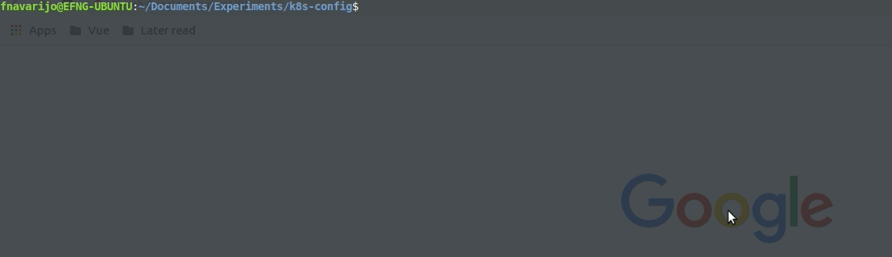

# K8S Config

Node tool useful to change k8s context.

### Usage
```
k8sconfig
```
This will display your available k8s contexts. Select the one you want to set.

### Motivation
Tired of writing
```
kubectl config current-context
kubectl config get-contexts
kubectl config use-context *context*
```

I wanted to simplify the process with a command, like this.
